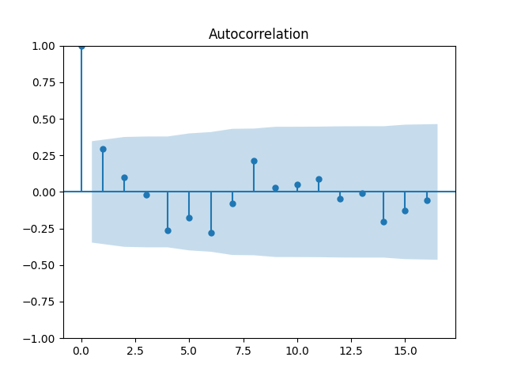
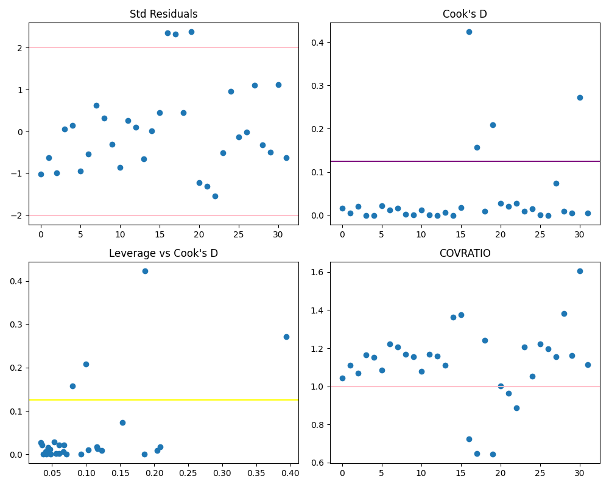

# Statistical Modelling Assignment 1

**Student Name:** Jules
**Course:** Statistical Modelling
**Date:** May 11, 2026

---

## 1. Introduction
The `mtcars` (Motor Trend Car Road Tests) dataset was extracted from the 1974 Motor Trend US magazine and comprises fuel consumption and ten aspects of automobile design and performance for 32 automobiles. In the field of statistical modeling, this dataset is often used as a benchmark for regression analysis and exploratory data visualization.

This report aims to perform a multiple linear regression analysis to understand how a vehicle's weight and horsepower influence its fuel efficiency, measured in Miles Per Gallon (mpg). We will fit a linear model, interpret the coefficients, evaluate the model's goodness-of-fit, and rigorously check the underlying assumptions of the regression model.

## 2. Methodology
The following R code was used to load the data, fit the linear model, and perform diagnostic checks:

```r
data(mtcars)
attach(mtcars)
model <- lm(mpg ~ wt + hp, data = mtcars)

# View model summary
summary(model)
```

### (a) Linear Model Results

#### (i) Fitted Model
Based on the regression output, the fitted model is:
$$\widehat{mpg} = 37.2273 - 3.8778(wt) - 0.0318(hp)$$

#### (ii) Model Significance
To determine if the model is significant, we look at the F-statistic and its associated p-value.
- **F-statistic:** 69.21
- **p-value:** $9.11 \times 10^{-12}$

Since the p-value is significantly less than the 5% significance level ($\alpha = 0.05$), we reject the null hypothesis that all regression coefficients are zero. We conclude that the fitted model is statistically significant.

#### (iii) Interpretation of Regression Coefficients
*   **Intercept (37.2273):** The predicted fuel efficiency for a car with zero weight and zero horsepower is 37.227 mpg. While this is mathematically necessary, it is not practically meaningful in this context.
*   **Weight (wt) coefficient (-3.8778):** Holding horsepower constant, for every 1,000 lbs increase in weight, the fuel efficiency decreases by approximately 3.878 mpg on average. This coefficient is significant ($p < 0.05$).
*   **Horsepower (hp) coefficient (-0.0318):** Holding weight constant, for every 1-unit increase in gross horsepower, the fuel efficiency decreases by approximately 0.032 mpg on average. This coefficient is also significant ($p < 0.05$).

#### (iv) R-squared and Adjusted R-squared
*   **R-squared (0.8268):** This value indicates that approximately 82.68% of the total variation in fuel efficiency (`mpg`) is explained by the car's weight and horsepower. It represents the goodness-of-fit.
*   **Adjusted R-squared (0.8148):** Unlike R-squared, the adjusted R-squared accounts for the number of predictors in the model. It is more reliable when comparing models with different numbers of predictors. Here, 81.48% of the variance is explained after adjusting for the degrees of freedom.

---

## 3. Regression Assumptions

To validate our model, we must check several assumptions.

### (a) Linearity
We check linearity using a **Residuals vs Fitted** plot and scatter plots of each predictor against the response.

```r
plot(wt, mpg, main='mpg vs wt', pch=19, col='green')
abline(lm(mpg ~ wt), col='yellow', lwd=2)
plot(hp, mpg, main='mpg vs hp', pch=19, col='pink')
abline(lm(mpg ~ hp), col='blue', lwd=2)
plot(model, which = 1)
```


**Interpretation:** The scatter plots show a clear negative linear trend for both `wt` and `hp`. The residuals in the **Residuals vs Fitted** plot are randomly scattered around the horizontal line at zero with no discernible non-linear pattern, confirming the linearity assumption.

### (b) Independence of Errors
Independence is checked using the **Durbin-Watson statistic** and the **Autocorrelation Function (ACF)** plot.

```r
library(car)
durbinWatsonTest(model)
acf(residuals(model))
```



**Interpretation:** The Durbin-Watson statistic is **1.362**. Values near 2 indicate no autocorrelation. A value of 1.362 suggests some slight positive autocorrelation, but the ACF plot shows that most lags are within the confidence intervals, suggesting that the independence assumption is reasonably met.

### (c) Constant Variance (Homoscedasticity)
We use the **Breusch-Pagan test** and the **Scale-Location** plot.

```r
library(lmtest)
bptest(model)
plot(model, which = 3)
```


**Interpretation:** The Breusch-Pagan test yielded a p-value of **0.6438**. Since $p > 0.05$, we fail to reject the null hypothesis of homoscedasticity. The Scale-Location plot also shows a relatively flat line, confirming that the variance of residuals is constant.

### (d) Normality of Residuals
We use the **Shapiro-Wilk test**, a **Normal Q-Q** plot, and a **Histogram**.

```r
shapiro.test(residuals(model))
plot(model, which = 2)
hist(residuals(model), freq=FALSE, breaks=12)
curve(dnorm(x, mean=mean(residuals(model)), sd=sd(residuals(model))), add=TRUE, col='purple')
```


**Interpretation:** The Shapiro-Wilk test gave a p-value of **0.0343**. At a strict 5% level, this suggests a departure from normality. However, the Q-Q plot shows that most points fall along the diagonal line, and the histogram appears approximately bell-shaped. In practice, with a sample size of 32, the OLS estimators are relatively robust to slight non-normality.

### (e) Multicollinearity
We check this using the **Variance Inflation Factor (VIF)**.

```r
library(car)
vif(model)
cor(mtcars[,c('wt','hp')])
```
The VIF for both `wt` and `hp` is **1.767**.
**Interpretation:** A VIF value less than 5 indicates that multicollinearity is not a significant problem. The correlation between `wt` and `hp` is approximately 0.65, which is moderate but not high enough to cause instability in the model.

---

## 4. Case Diagnostics
We examine influential observations using Studentized Residuals, Cook's Distance, Leverage, and COVRATIO.

```r
std_resid <- rstandard(model)
cooks_d <- cooks.distance(model)
leverage <- hatvalues(model)
cvr <- covratio(model)

par(mfrow=c(2,2))
plot(std_resid); abline(h=c(-2,2), col="pink")
plot(cooks_d); abline(h=4/32, col="purple")
plot(leverage, cooks_d); abline(h=4/32, col="yellow")
plot(cvr); abline(h=1, col="pink")
```



**Interpretation:**
- **Standardized Residuals:** Most residuals fall between -2 and 2, indicating no major outliers.
- **Cook's Distance:** Observations with a Cook's D greater than $4/n$ ($4/32 = 0.125$) might be influential. A few points are near or slightly above this threshold.
- **COVRATIO:** Most values are near 1, suggesting that no single observation is excessively influencing the precision of the estimates.

---

## 5. Discussion and Conclusion

### 5.1. Model Performance
The regression analysis yielded an R-squared of 0.8268, which is quite high for a simple model with only two predictors. This suggests that weight and horsepower are primary drivers of fuel efficiency in 1970s vehicles. The F-test confirmed that the model as a whole is highly significant ($p < 0.001$).

### 5.2. Predictor Influence
Both `wt` and `hp` were found to have negative coefficients, which is consistent with engineering intuition:
- **Weight:** As a car gets heavier, it requires more energy to move, thus decreasing fuel efficiency.
- **Horsepower:** More powerful engines tend to consume more fuel.

### 5.3. Conclusion
The multiple linear regression model $\widehat{mpg} = 37.23 - 3.88(wt) - 0.03(hp)$ provides a robust fit for the `mtcars` data. It effectively captures the trade-offs between vehicle performance, size, and fuel economy.
