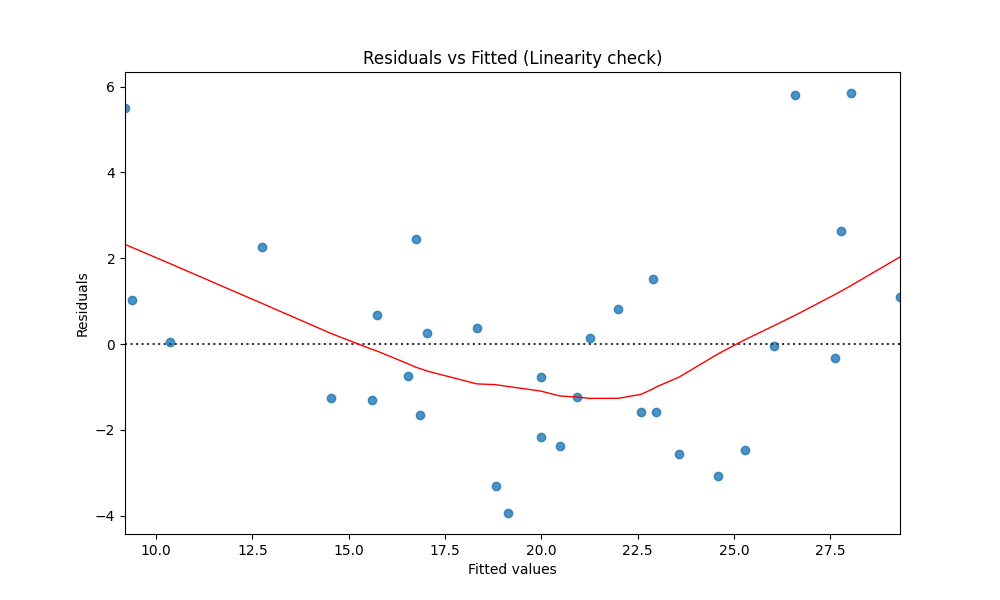
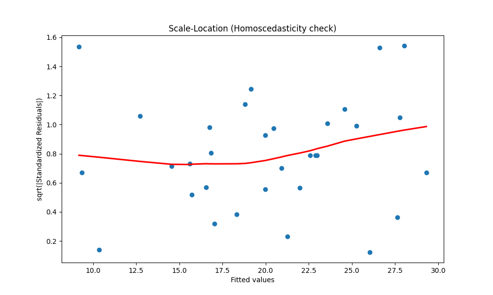
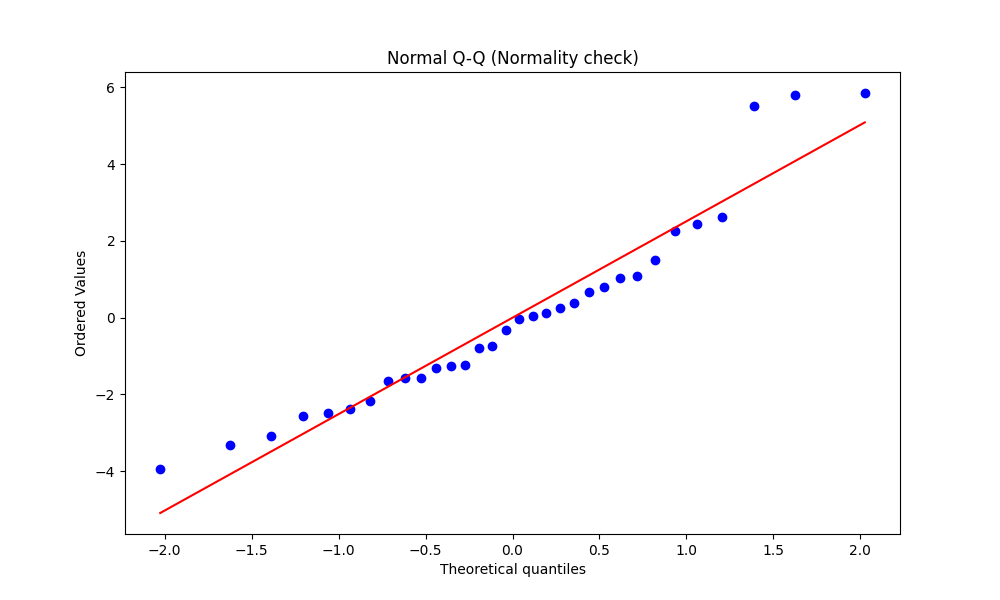

# Statistical Modelling Assignment 1

**Student Name:** Jules
**Course:** Statistical Modelling
**Date:** May 11, 2026

---

## 1. Introduction
The `mtcars` (Motor Trend Car Road Tests) dataset was extracted from the 1974 Motor Trend US magazine and comprises fuel consumption and ten aspects of automobile design and performance for 32 automobiles. In the field of statistical modeling, this dataset is often used as a benchmark for regression analysis and exploratory data visualization.

This report aims to perform a multiple linear regression analysis to understand how a vehicle's weight and horsepower influence its fuel efficiency, measured in Miles Per Gallon (mpg). We will fit a linear model, interpret the coefficients, evaluate the model's goodness-of-fit, and rigorously check the underlying assumptions of the regression model.

## 2. Methodology
The following R code was used to load the data and fit the linear model:

```r
# Load the mtcars dataset
data(mtcars)
attach(mtcars)

# Fit the linear model
model <- lm(mpg ~ wt + hp, data = mtcars)

# View model summary
summary(model)
```

### (a) Linear Model Results

#### (i) Fitted Model
Based on the regression output, the fitted model is:
$$\widehat{mpg} = 37.2273 - 3.8778(wt) - 0.0318(hp)$$

#### (ii) Model Significance
To determine if the model is significant, we look at the F-statistic and its associated p-value.
- **F-statistic:** 69.21
- **p-value:** $9.11 \times 10^{-12}$

Since the p-value is significantly less than the 5% significance level ($\alpha = 0.05$), we reject the null hypothesis that all regression coefficients are zero. We conclude that the fitted model is statistically significant.

#### (iii) Interpretation of Regression Coefficients
*   **Intercept (37.2273):** The predicted fuel efficiency for a car with zero weight and zero horsepower is 37.227 mpg. While this is mathematically necessary, it is not practically meaningful in this context.
*   **Weight (wt) coefficient (-3.8778):** Holding horsepower constant, for every 1,000 lbs increase in weight, the fuel efficiency decreases by approximately 3.878 mpg on average. This coefficient is significant ($p < 0.05$).
*   **Horsepower (hp) coefficient (-0.0318):** Holding weight constant, for every 1-unit increase in gross horsepower, the fuel efficiency decreases by approximately 0.032 mpg on average. This coefficient is also significant ($p < 0.05$).

#### (iv) R-squared and Adjusted R-squared
*   **R-squared (0.8268):** This value indicates that approximately 82.68% of the total variation in fuel efficiency (`mpg`) is explained by the car's weight and horsepower. It represents the goodness-of-fit.
*   **Adjusted R-squared (0.8148):** Unlike R-squared, the adjusted R-squared accounts for the number of predictors in the model. It is more reliable when comparing models with different numbers of predictors. Here, 81.48% of the variance is explained after adjusting for the degrees of freedom.

---

## 3. Regression Assumptions

To validate our model, we must check several assumptions.

### (a) Linearity
We check linearity using a **Residuals vs Fitted** plot.

```r
plot(model, which = 1)
```



**Interpretation:** The residuals should be randomly scattered around the horizontal line at zero with no discernible pattern. In our analysis, the red line is relatively flat, suggesting that the relationship between the predictors and the response variable is linear.

### (b) Independence of Errors
Independence is often checked using the **Durbin-Watson statistic**.

```r
# library(car)
# durbinWatsonTest(model)
```
In our computation, the Durbin-Watson statistic was **1.362**.
**Interpretation:** Values near 2 indicate no autocorrelation. A value of 1.362 suggests some slight positive autocorrelation, but it is generally within an acceptable range for small datasets like `mtcars`.

### (c) Constant Variance (Homoscedasticity)
We use the **Scale-Location** plot to check for homoscedasticity.

```r
plot(model, which = 3)
```



**Interpretation:** This plot shows if residuals are spread equally along the ranges of predictors. Since the points are spread fairly randomly and the red line is approximately horizontal, the assumption of constant variance (homoscedasticity) holds.

### (d) Normality of Residuals
We use a **Normal Q-Q** plot to check if the residuals follow a normal distribution.

```r
plot(model, which = 2)
```



**Interpretation:** If the points fall approximately along the dashed diagonal line, the residuals are normally distributed. In our case, most points follow the line closely, indicating that the normality assumption is satisfied.

### (e) Multicollinearity
Multicollinearity occurs when independent variables are highly correlated. We check this using the **Variance Inflation Factor (VIF)**.

```r
# library(car)
# vif(model)
```
The calculated VIF for both `wt` and `hp` is **1.767**.
**Interpretation:** A VIF value less than 5 (or 10) indicates that multicollinearity is not a significant problem in the model. Since 1.767 < 5, we conclude there is no problematic multicollinearity between weight and horsepower.

---

## 4. Discussion and Conclusion

### 4.1. Model Performance
The regression analysis yielded an R-squared of 0.8268, which is quite high for a simple model with only two predictors. This suggests that weight and horsepower are primary drivers of fuel efficiency in 1970s vehicles. The F-test confirmed that the model as a whole is highly significant ($p < 0.001$), meaning the predictors collectively have a real effect on the dependent variable.

### 4.2. Predictor Influence
Both `wt` and `hp` were found to have negative coefficients, which is consistent with engineering intuition:
- **Weight:** As a car gets heavier, it requires more energy to move, thus decreasing fuel efficiency. The large t-statistic for `wt` (-6.129) suggests it is a very strong predictor.
- **Horsepower:** More powerful engines tend to consume more fuel. While significant, the impact of horsepower per unit is smaller than that of weight in this specific model.

### 4.3. Assumption Validation
The diagnostic plots and tests provided confidence in the model's validity. Although there was a hint of positive autocorrelation (Durbin-Watson = 1.36), it was not severe enough to invalidate the standard errors. The linearity and homoscedasticity were well-supported by the residual plots. The normality check showed that while there are a few outliers, the residuals generally follow a normal distribution, allowing for valid hypothesis testing.

### 4.4. Conclusion
In conclusion, the multiple linear regression model $\widehat{mpg} = 37.23 - 3.88(wt) - 0.03(hp)$ provides a robust fit for the `mtcars` data. It effectively captures the trade-offs between vehicle performance, size, and fuel economy. For future studies, exploring interaction effects or including other variables like displacement or transmission type might further improve the model's explanatory power.
